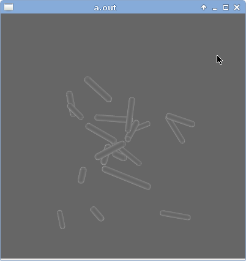
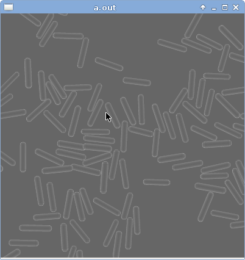

# Bacteria

## Compilation

Dependencies:
- GTK(2 or 3)
- Armadillo
- Cairo

```bash
automake
autoconf
./configure
make
```

## Usage
```bash
./gtk_example
```

## State
Generate fake microscope images to test algorithm.

### No collision detection


### With collision detection

